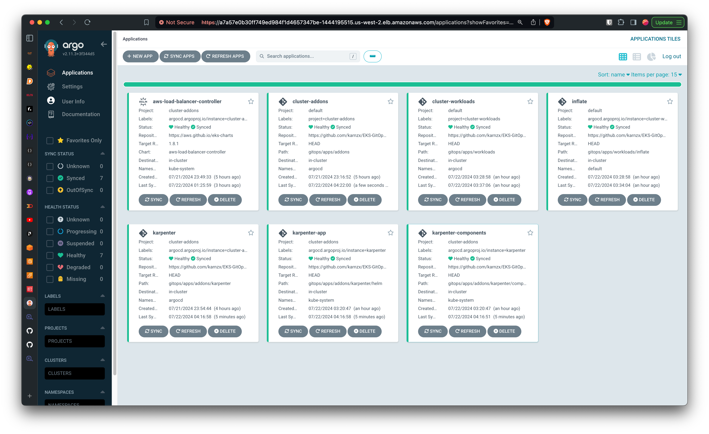

# EKS-GitOps-CICD

A repository dedicated to deploying and managing applications on AWS EKS using GitOps principles. Includes Terraform infrastructure code, ArgoCD configurations, and CI/CD pipelines.

Consider these Directory as Git repository.

- Terraform
- GitOps
- Dummy-nodejs

Terraform apply locally (Terraform State should store on cloud)
CI/CD workflow create for dummy-nodejs

## Flow

Terraform provisioning infrastructure on AWS and boostraping deploy Argocd and Argocd-apps using Helm
Argocd-app in Terraform deploy Argocd App in GitOps (using Argocd App of Apps pattern)
dummy-nodejs deployed from kubernetes manifest duumy-nodejs in GitOps workloads.

