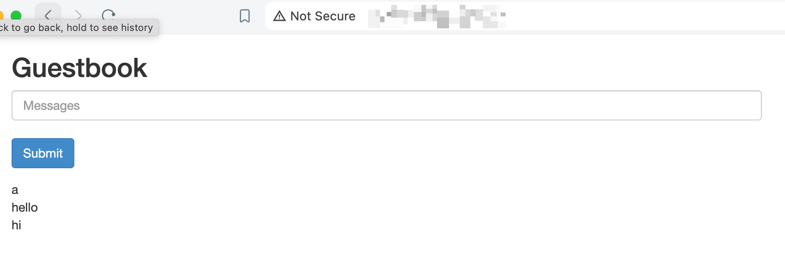
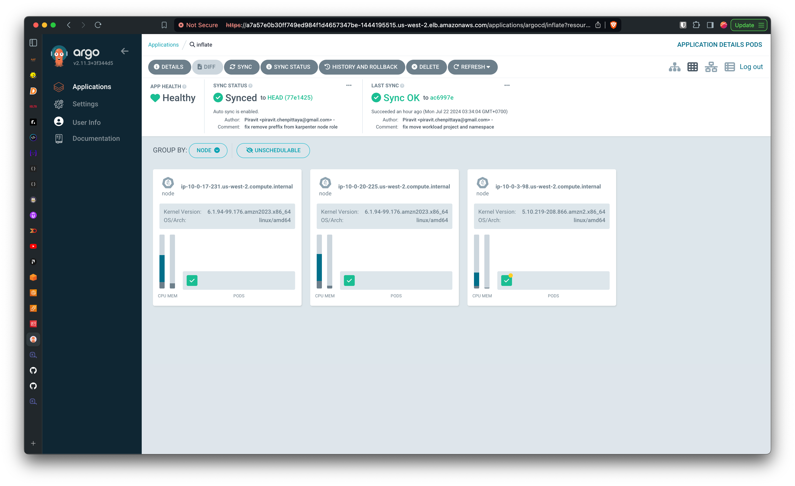
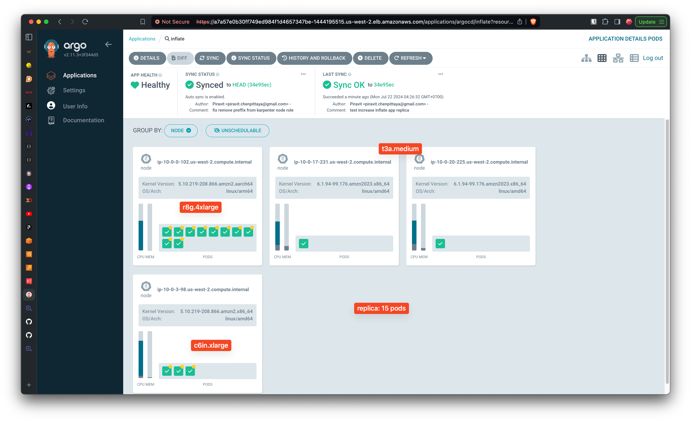

# GitOps

Use to provide ArgoCD application to continuous delivery for kubernetes in declarative way.

these are root app which deployed by argocd-app from Helm (deployed by Terraform)

- addons (cluster addons)
- workload (cluster workloads)

## Guestbook Page

## Inflate scale

leverage karpenter to scale node when pod increase

replica 3

replica 15

replica 30

