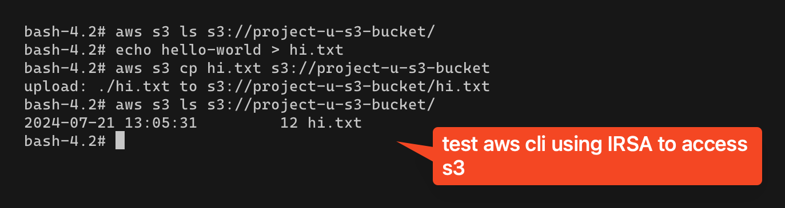
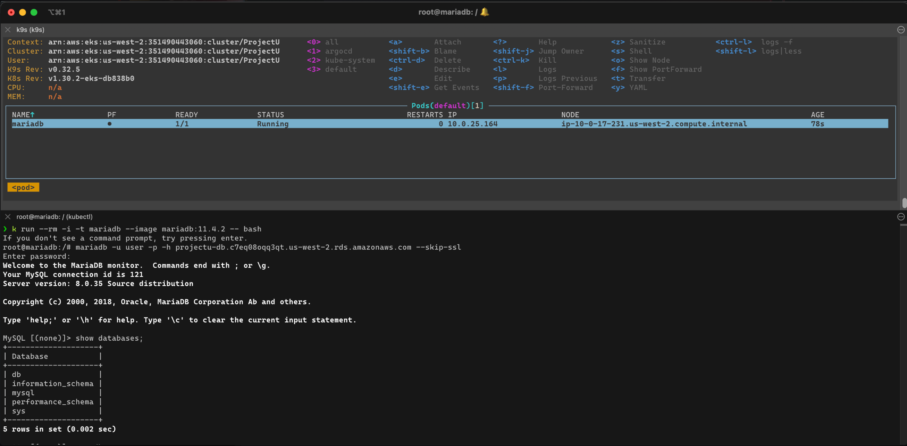

# Terraform

Use to provisioning infrastructure such as AWS EKS, S3, RDS on AWS provider
Terraform 1.8.1

To create

```shell
terraform init
terraform plan -out plan
terraform apply plan
```

To get Kubeconfig file run

```shell
aws eks update-kubeconfig --name "ProjectU" --dry-run > .kubeconfig
```

To destroy

make sure S3 bucket is empty, RDS delete protection is disabled then

```shell
terraform destroy
```

## Test

Test AWS S3 IRSA, access AWS S3 from eks pod



Test connection from EKS pod to RDS


